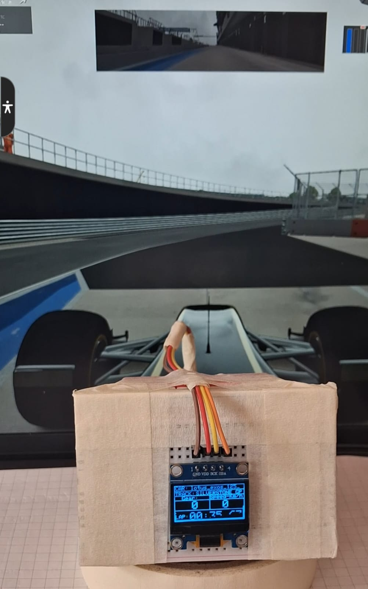
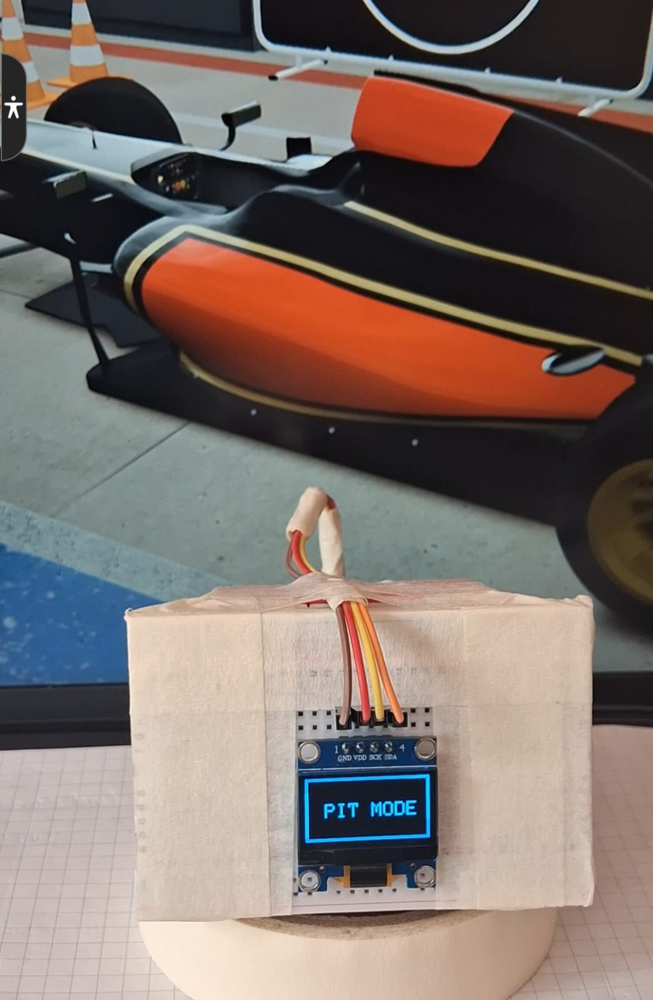
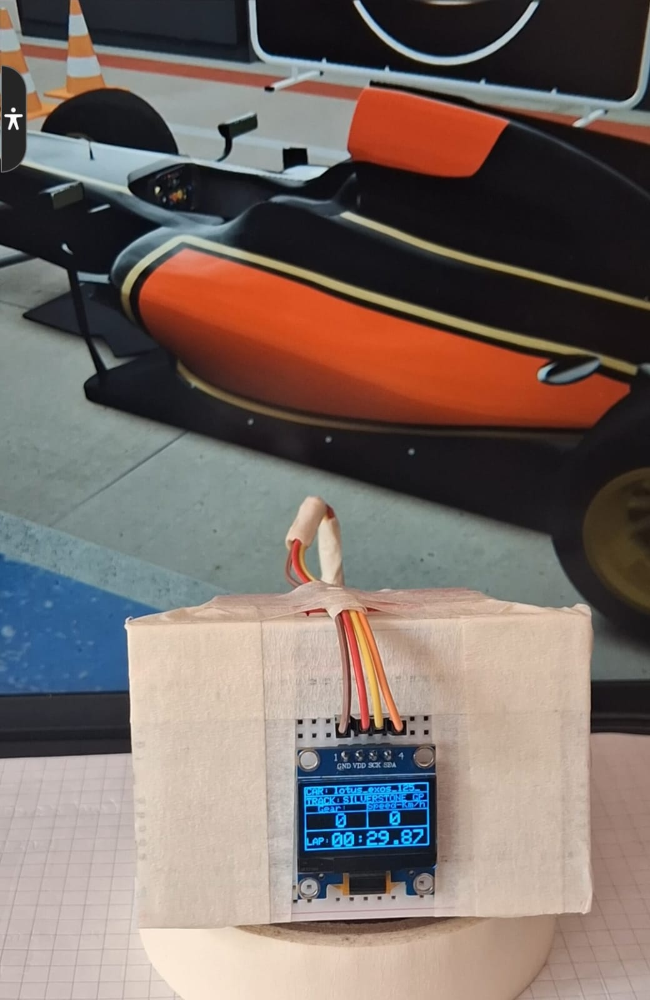

# sim-racing-dashboard
ESP32-based sim racing dashboard for Assetto Corsa, featuring F1-style real-time telemetry on an SSD1306 OLED display via Python and serial communication

# Assetto Corsa F1 Telemetry Dashboard (ESP32 + SSD1306)

An embedded telemetry dashboard for the Assetto Corsa racing simulator. This project uses an ESP32 microcontroller connected to an OLED SSD1306 display and receives live car telemetry (speed, gear, lap time, pit status, car name) via a serial link from a Python script running pc-side. Ideal for F1 fans, makers, and sim racers seeking real-time, physical HUD visualization.

## Hardware Setup

This is what the dashboard looks like on the breadboard:

## Features
- Real-time display of car speed, gear, lap time, pit status, and car name
- F1-inspired HUD layout for SSD1306 OLED (128x64 px)
- Pit mode indicator and lap time formatting
- Compatible with any ESP32 board, SSD1306 display, and standard breadboard setup

## Hardware Required
- ESP32 development board
- SSD1306 OLED display (I2C, 128x64)
- Breadboard and jumper wires
- USB cable for serial connection

## Software Required
- Python 3 (for telemetry extraction script)
- pyaccsharedmemory Python library
- Arduino IDE (for ESP32 code), or PlatformIO alternative

## Wiring
| Device     | ESP32 Pin | Note         |
|------------|-----------|--------------|
| SSD1306 SCL| GPIO 22   | I2C Clock    |
| SSD1306 SDA| GPIO 21   | I2C Data     |
| VCC/GND    | 3.3V/GND  | Power supply |
| Serial     | USB       | PC link      |

## Setup

### 1. Flash the ESP32
- Open the `main.ino` sketch in Arduino IDE
- Connect SSD1306 as above
- Install Adafruit_SSD1306 and Adafruit_GFX libraries
- Select ESP32 board in Tools → Board, select port, and upload

### 2. Run the Python Telemetry Script
- Install dependencies: `pip install pyaccsharedmemory`
- Edit `SERIAL_PORT` (e.g. `COM9`) in the Python script to match ESP32
- Launch script when Assetto Corsa is running; it automatically streams telemetry to ESP32

### 3. Start Racing
- On driving, dashboard displays real-time info.
- PIT MODE indicator flashes when car enters pits.

## Credits
Inspired by F1 dashboard displays and the Assetto Corsa modding community.
